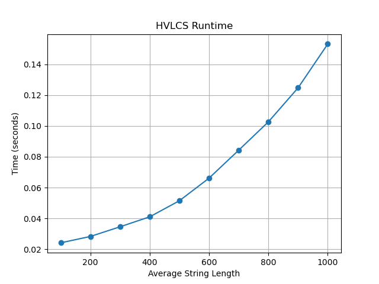

# Algo-Programming-Assignment-3

# Highest Value Longest Common Sequence (HVLCS)

## Team Members
* Carlo Fraley - UFID in canavs comment
* Kavi Patel - UFID in canvas comment

## Execution Instructions
* **Prerequisites:** Python 3
* **Run:** `python src/hvlcs.py < data/example.in`

## Assumptions
* Input files will follow the format order of alphabet size, character value mappings, then the two strings.

## Written Component

### Question 1: Empirical Comparison

We ran the algorithm on 10 input files with average string lengths ranging from ~95 to ~1000 characters.

The graph shows that runtime grows as input string length increases, which is consistent with the O(n·m) DP table construction. For shorter strings the runtime is almost instant, while the largest inputs (length ~1000) take noticeably longer ,showing the quadratic nature of the algorithm.

### Question 2: Recurrence Equation

* **Recurrence:** Let $M[i][j]$ represent the maximum value of a common subsequence between the prefix of string A (length $i$) and the prefix of string B (length $j$), with $v(A[i])$ being the value of the character.
  
  $$M[i][j] = M[i-1][j-1] + v(A[i]) \quad \text{if } A[i] = B[j]$$
  
  $$M[i][j] = \max(M[i-1][j], M[i][j-1]) \quad \text{if } A[i] \neq B[j]$$

* **Base Cases:** $M[i][0] = 0$ and $M[0][j] = 0$ for all i and j. 
  This occurs because comparing any string against an empty string yields a common subsequence of length zero, which has a total value of zero, and we account for this for both i and j.

* **Correctness:** When characters match, adding the character's value to the previous optimal state guarantees the maximum running total. This reflects the part where we add the character's value and then move the index down by one for both i and j. When characters mismatch, we want to carry forward the maximum value from whichever preceding prefix path is best, which is why we check the max for moving down the index in either the A string or the B string.

### Question 3: Big-Oh

**Pseudocode:**
HVLCS(A,B,v):
n = length of A
m = length of B
create table M[0..n][0..m], initialized to 0
for i from 1 to n:
  for j from 1 to m:
    if A[i] == B[j]:
      M[i][j] = M[i-1][j-1] + v(A[i])
    else:
      M[i][j] = max(M[i-1][j], M[i][j-1])
return M[n][m]

**Runtime:** O(n*m), where n and m are lengths of string A and B. This is because we fill an nxm table and do O(1) (constant) work per cell.